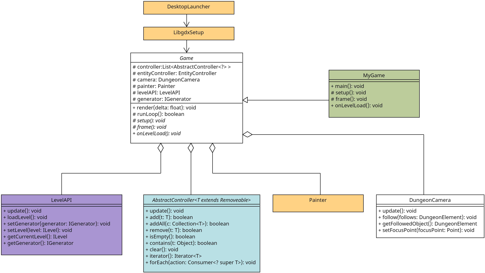
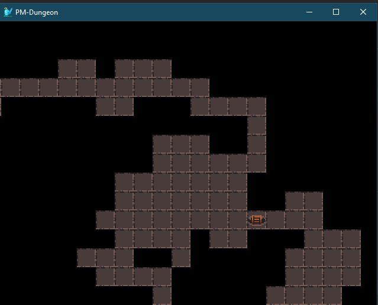
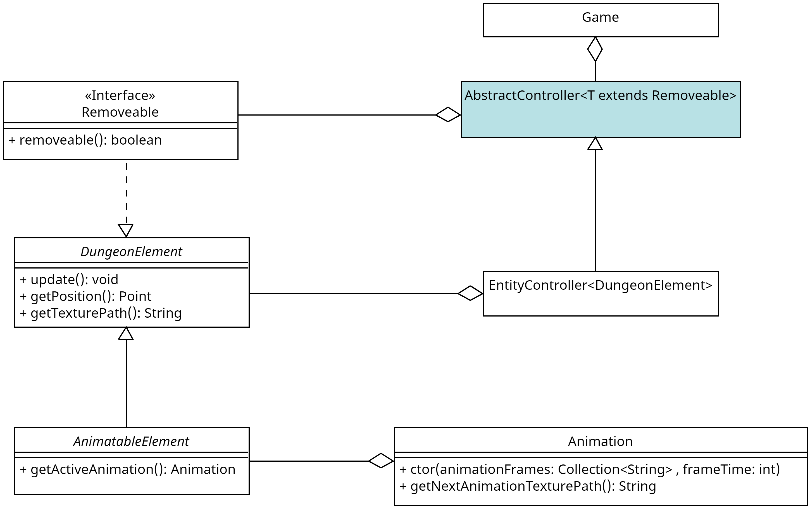
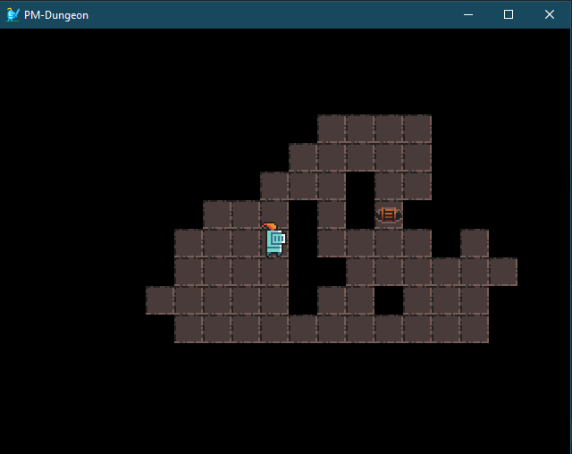
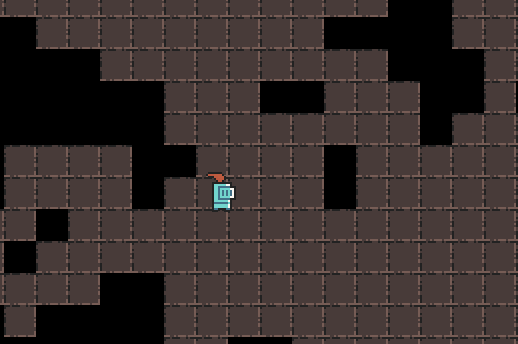
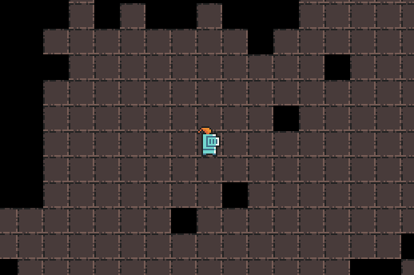
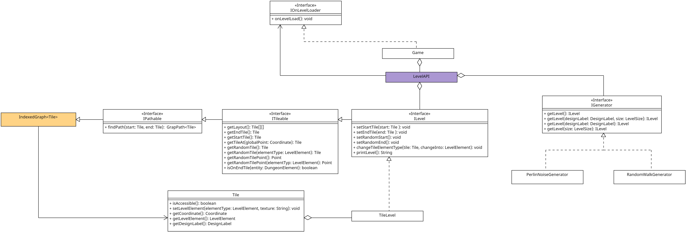
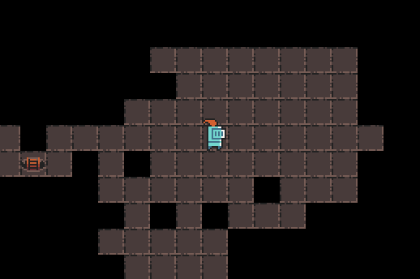

# Quickstart


Dieses Dokument liefert einen Einstieg in das PM-Dungeon. Es erläutert die Installation des Frameworks und die ersten Schritte, um eigene Inhalte zum Dungeon hinzuzufügen. Es dient als Grundlage für alle weiteren Praktika. Lesen Sie das Dokument daher aufmerksam durch und versuchen Sie sich zusätzlich selbst mit dem Aufbau vertraut zu machen.
Das Framework befindet sich im [`PM-Dungeon`](https://github.com/Programmiermethoden/PM-Dungeon)-Repo.

Sie benötigen nur dieses Framework für die Aufgaben, die zusätzlichen Abhängigkeiten werden automatisch über Gradle eingebunden.

*Hinweis: Achten Sie darauf, Daten nur dann in öffentliche Git-Repos zu laden, wenn Sie die nötigen Rechte an diesen Daten haben. Dies gilt insbesondere auch für Artefakte wie Bilder, Bitmaps, Musik oder Soundeffekte.*

## Installation

Sie werden das Java SE Development Kit 17.x.x oder höher benötigen.

Für eine Anleitung, wie Sie das Projekt in Ihrer IDE laden können, schauen Sie bitte in das [PM-Dungeon-Wiki: "Import Project"](https://github.com/Programmiermethoden/PM-Dungeon/wiki/Import-Project).

*Anmerkung: Sollten bei der Installation Probleme auftreten, ist vielleicht ein Blick in die [FAQ](https://github.com/Programmiermethoden/PM-Dungeon/wiki/FAQ) bzw. die [Kompatibilitätsliste](https://github.com/Programmiermethoden/PM-Dungeon/wiki/JDK-Kompatibilit%C3%A4t) hilfreich. Sollten Sie Ihr Problem dennoch nicht lösen können, melden Sie sich bitte frühzeitig bei uns.*

## Arbeiten mit dem Framework

Zu Beginn einige grundlegende Prinzipien, die Sie verstanden haben sollten, bevor Sie mit dem Dungeon arbeiten.

Das PM-Dungeon benutzt das Cross-Plattform-Java-Framework [`libGDX`](https://libgdx.com) als Backend.
Dieses ist im `PM-Dungeon`-Projekt bereits als Abhängigkeit in die Gradle-Konfiguration integriert, Sie müssen dieses nicht extra installieren. Die Ihnen zur Verfügung gestellten Vorgaben sind so umgesetzt, dass Sie kein tieferes Verständnis für das Framework oder `libGDX` benötigen, um die Aufgaben zu lösen. Sollten Sie allerdings einmal auf Probleme stoßen, kann es unter Umständen helfen, einen Blick in die [Dokumentation von `libGDX`](https://libgdx.com/wiki/) zu werfen.

Das Framework fungiert, ganz vereinfacht gesagt, als eine Facade zwischen `libGDX` und Ihrer eigenen Implementierung. Es liefert die Schnittstellen, mit denen Sie arbeiten sollen.
Sie selbst schreiben die Logik des Spiels und implementieren die Helden/Monster/Gegenstände/usw.

Bis auf einige seltene (dokumentierte) Ausnahmen werden Sie nicht gezwungen sein, an den Vorgaben Änderungen durchzuführen.

Sie werden im Laufe der Praktika verschiedene Assets benötigen. Diese liegen per Default im `assets`-Verzeichnis. Sie können das Standardverzeichnis in der `build.gradle` anpassen.

- Standardpfad für Texturen: `assets/`
- Standardpfad für Charaktere: `assets/character/`
- Standardpfad für Level-Texturen: `assets/textures/dungeon/`

## Strukturen

Bevor wir mit der eigentlichen Implementierung des Spiels anfangen, eine kurze Erklärung über den Aufbau des Frameworks.

- Das Framework verwendet sogenannte `Controller` um die einzelnen Aspekte des Spiels zu managen und Ihnen das Leben einfacher zu machen.
    - `EntityController`: Dieser verwaltet alle "aktiven" Elemente wie Helden, Monster, Items etc.
    - `LevelAPI`: Kümmert sich darum, dass neue Level erzeugt und geladen werden.
    - `ScreenController`: Verwaltet alle Bildschirm-Anzeigen, die Sie implementieren.
    - `Game` Verwaltet die anderen `Controller` und beinhaltet die Game-Loop. Ihre Implementierung wird Teil des `MyGame`.
- Game-Loop: Die Game-Loop ist die wichtigste Komponente des Spieles. Sie ist eine Endlosschleife, welche einmal pro [Frame](https://de.wikipedia.org/wiki/Bildfrequenz) aufgerufen wird. Das Spiel läuft in 30 FPS (also 30 *frames per seconds*), die Game-Loop wird also 30-mal in der Sekunde aufgerufen. Alle Aktionen, die wiederholt ausgeführt werden müssen, wie zum Beispiel das Bewegen und Zeichnen von Figuren, müssen innerhalb der Game-Loop stattfinden. Das Framework ermöglicht es Ihnen, eigene Aktionen in die Game-Loop zu integrieren. Wie genau das geht, erfahren Sie im Laufe dieser Anleitung.
- Zusätzlich existieren noch eine Vielzahl an weiteren Hilfsklassen, mit denen Sie mal mehr oder mal weniger Kontakt haben werden.
- `Painter`: Kümmert sich darum, dass die Inhalte grafisch dargestellt werden.
- `DungeonCamera`: Ihr Auge in das Dungeon.

*Hinweis: Die Game-Loop wird automatisch ausgeführt, Sie müssen sie nicht aktiv aufrufen.*


*Anmerkung: Dieses UML ist vereinfacht und an entsprechenden stellen abstrahiert, um Ihnen einen möglichst guten Überblick über das Framework zu verschaffen.*

## Erster Start

Die Vorgaben sind bereits lauffähig und können direkt ausgeführt werden. Dafür können Sie die Vorgaben entweder als Projekt in Ihrer IDE laden (siehe auch [PM-Dungeon-Wiki: "Import Project"](https://github.com/Programmiermethoden/PM-Dungeon/wiki/Import-Project)) und die Anwendung über die Run-Funktion Ihrer IDE starten oder Sie starten die Anwendung über die Kommandozeile per `./gradlew run`. Öffnen Sie dafür die Konsole, gehen Sie in das `PM-Dungeon/code/`-Verzeichnis und geben Sie folgenden Befehl ein:

- Unter Windows: `.\gradlew run`
- Unter Linux: `./gradlew run`

*Anmerkung: Sollten beim Starten Probleme auftreten, ist vielleicht ein Blick in die [FAQ](https://github.com/Programmiermethoden/PM-Dungeon/wiki/FAQ) bzw. die [Kompatibilitätsliste](https://github.com/Programmiermethoden/PM-Dungeon/wiki/JDK-Kompatibilit%C3%A4t) hilfreich. Sollten Sie Ihr Problem dennoch nicht lösen können, melden Sie sich bitte frühzeitig bei uns.*



*Anmerkung: Wir verwenden in unserem Beispiel zufällig generierte Level, daher werden Sie vermutlich nicht das exakt gleiche Level sehen wie auf unseren Abbildungen.*

## Blick in den Code

Betrachten wir nun den `code/core/src/starter/MyGame.java`. Diese Klasse ist Ihr Einstiegspunkt in den Dungeon. Hier werden Sie später Ihre Inhalte erzeugen und in den Dungeon hinzufügen.

`MyGame` erbt von `Game`. `Game` kann als Hauptcontroller Verstanden werden und ist die Haupt-Steuerung des Spiels. Es bereitet alles für den Start des Spieles vor, verwaltet die anderen Controller und enthält die Game-Loop. Sie nutzen `MyGame`, um selbst in die Game-Loop einzugreifen und unsere eigenen Objekte wie Helden und Monster zu verwalten. `Game` ist der Punkt, an dem alle Fäden des Dungeons zusammenlaufen.

`MyGame` implementiert bereits einige Methoden:

- `setup` wird zu Beginn der Anwendung aufgerufen. In dieser Methode werden später die Objekte initialisiert und konfiguriert, welche bereits vor dem Spielstart existieren müssen. In der Vorgabe wird hier bereits das erste Level geladen.
- `update` Aktualisiert alle Elemente, die beim Controller registriert sind, entfernt löschbare Elemente und ruft die Update- und Draw-Methode für jedes registrierte Element auf.
- `onLevelLoad` wird immer dann aufgerufen, wenn ein Level geladen wird. Hier werden später Monster und Items erstellt, die initial im Level verteilt werden.
- `frame` wird jedem Frame einmal aufgerufen.
- `main` startet das Spiel.

## Eigener Held

Jetzt, wo Sie sichergestellt haben, dass das Dungeon ausgeführt werden kann, geht es darum, das Spiel mit Ihren Inhalten zu erweitern. Im Folgenden wird schrittweise ein rudimentärer Held implementiert, um Ihnen die verschiedenen Aspekte des Dungeon zu erläutern.


*Anmerkung: Dieses UML ist vereinfacht und an entsprechenden stellen abstrahiert, um Ihnen einen möglichst guten Überblick über das Framework zu verschaffen.*

Fangen wir damit an, eine neue Klasse für den Helden anzulegen. Unser Held soll grafisch dargestellt werden und vom `EntityController` verwaltet werden können. Daher erbt er von der abtrakten Klasse `basiselements.DungeonElement`.

Diese abstrakte Klasse `basiselements.DungeonElement` liefert einige Methoden, welche wir implementieren müssen.

- `getPosition` gibt an, wo unser Held im Dungeon steht. Weiter unten folgt eine genauere Erklärung des verwendeten Koordinaten- und Positionssystem.
- `getTexturePath` gibt an, welche Textur verwendet werden soll, wenn unser Held gezeichnet wird.

Für beide Methoden legen wir uns Attribute an, die immer den aktuellen Wert speichern und diesen in den getter-Methoden zurückliefern.

Zuerst benötigt unser Held eine Textur, die gezeichnet werden soll, um den Helden darzustellen. Im Framework arbeiten wir immer mit den relativen Pfaden (ausgehend vom `asset/` Verzeichnis), um die Texturen zu laden.
Daher speichern wir einen String mit dem Pfad zu der Textur ab und geben diesen in `getTexturePath()` zurück.

Damit wir unseren Helden im Level platziern können, erstellen wir die Methode `setLevel`, dieser wird das aktuelle Level übergeben und der Held sucht sich dann die Startposition im Level und platziert sich dort.

```java
package mygame;

import basiselements.DungeonElement;
import level.elements.ILevel;
import tools.Point;

public class Hero extends DungeonElement {
    private String texture = "character/knight/knight_m_idle_anim_f0.png";
    private Point currentPosition;
    private ILevel currentLevel;

    public void setLevel(ILevel level) {
        currentLevel = level;
        currentPosition = level.getStartTile().getCoordinate().toPoint();
    }

    @Override
    public void update() {
        // do nothing
    }

    @Override
    public Point getPosition() {
        return currentPosition;
    }

    @Override
    public String getTexturePath() {
        return texture;
    }
}
```

Bevor wir weiter machen, sollten wir uns einmal den Aufbau des Level anschauen. Level werden als 2D-Tile-Array gespeichert. Ein `Tile` ist dabei ein Feld im Level, also eine Wand oder ein Bodenfeld. Jedes `Tile` hat eine feste `Coordinate` im Array (also einen Index, wo im Array das `Tile` abgespeichert ist). Diese `Coordinate` gibt auch an, wo das `Tile` im Level liegt. `Coordinate` sind zwei Integerwerte (`x` und `y`). Die Position von Entitäten geben wir als `Point` an. Ein `Point` sind zwei Floatwerte (`x` und `y`). Das machen wir, weil unsere Entitäten auch zwischen zwei `Tiles` stehen können. Wenn wir später die Steuerung für unseren Helden implementieren, wird dieses noch deutlicher. Jetzt ist wichtig, dass wir mit `Coordinate.toPoint()` unseren Helden auf die Position des Starttiles setzen können.

Jetzt müssen wir unseren Helden noch im Spiel hinzufügen. Dafür erstellen wir zuerst eine Instanz unserer Klasse in der `MyGame#setup` Methode.
Danach fügen wir unseren Helden dem `EntityController` hinzu, dieser sorgt jetzt dafür, dass unser Held regelmäßig aktualisert und gezeichnet wird.
Um unseren Helden eine Position im Level zuzuweisen, gehen wir in die `MyGame#onLevelLoad` Methode und rufen dort die `Hero#setLevel` Methode auf und übergeben das aktuelle Level.
Wenn wir schon dabei sind, können wir unsere Kamera auch so verändern, dass sie immer den Helden im Fokus hält. Das wird später noch nützlich.

```java
package starter;

import controller.Game;
import mygame.Hero;

/**
 * The entry class to create your own implementation.
 *
 * <p>This class is directly derived form {@link Game} and acts as the {@link
 * com.badlogic.gdx.Game}.
 */
public class MyGame extends Game {
    private Hero hero;

    @Override
    protected void setup() {
        hero = new Hero();
        entityController.add(hero);

        // set the default generator
        // levelAPI.setGenerator(new RandomWalkGenerator());
        // load the first level
        levelAPI.loadLevel();
    }

    @Override
    protected void frame() {}

    @Override
    public void onLevelLoad() {
        camera.follow(hero);
        hero.setLevel(levelAPI.getCurrentLevel());
    }

    /**
     * The program entry point to start the dungeon.
     *
     * @param args command line arguments, but not needed.
     */
    public static void main(String[] args) {
        // start the game
        DesktopLauncher.run(new MyGame());
    }
}
```

Möchten Sie, dass Ihr Hero oder eine andere Entität nicht mehr weiter vom `EntityController` verwaltet wird, z.B. wenn sie "stirbt", überschreiben Sie dafür in der jeweiligen Klasse die Methode `removeable`, die von der `Removeable`-Klasse geerbt wurde. Sobald diese Methode den Wert `true` zurückgibt, wird die Instanz im nächsten Frame aus dem `EntityController` entfernt. Wie im Beispiel zu sehen, wird die Entität dann entfernt, wenn die Lebenspunkte auf 0 gefallen sind.

Das folgende Beispiel ist für unseren Helden noch nicht direkt anwendbar (`lebenspunkte` ist noch nicht definiert), aber vielleicht wollen Sie diese Funktionalität irgendwann selbst implementieren.

```java
    @Override
    public boolean removable() {
        return lebenspunkte == 0;
    }
```

Wenn Sie das Spiel nun starten, sollten Sie ihren (unbeweglichen) Helden im Dungeon sehen können.



### Intermezzo: Der Assets-Ordner

Im Ordner [`code/assets/`](https://github.com/PM-Dungeon/dungeon-starter/tree/master/code/assets) werden alle Assets gespeichert, die im Dungeon verwendet werden. Assets sind dabei im Prinzip die Texturen, die später gezeichnet werden sollen.
Der `assets`-Ordner hat aber eine spezielle Adressierung.
Wenn der absolute Pfad zu einer Textur zum Beispiel `code/assets/character/knight/knight_m_idle_anim_f0.png` ist, dann geben wir den relativen Pfad zur Textur mit `character/knight/knight_m_idle_anim_f0.png` an.
Das Präfix `code/assets/` wird dabei also einfach weggelassen.

Bitte finden Sie selbst heraus, welche Texturen es gibt und verwendet werden können.

Der Assets-Ordner kann übrigens auch **umbenannt** oder an eine andere Stelle **verschoben** werden: Passen Sie dafür die Pfadangabe `sourceSets.main.resources.srcDirs = ["assets/"]` in der [`build.gradle`](https://github.com/PM-Dungeon/dungeon-starter/blob/master/code/build.gradle)-Datei an.

**Beispiel:** Sie möchten den Ordner `dungeon-starter/code/assets/` nach `dungeon-starter/code/bar/wuppie/` verschieben, dann ändern Sie `sourceSets.main.resources.srcDirs = ["assets/"]` in `sourceSets.main.resources.srcDirs = ["bar/wuppie/"]`.

Beachten Sie, dass der Ordner nur innerhalb von `dungeon-starter/code/` umbenannt bzw. verschoben werden kann.

Später werden Sie es wahrscheinlich praktischer finden, anstelle von relativen Pfaden den [`textures/TextureHandler.java`](https://github.com/PM-Dungeon/core/blob/master/code/core/src/textures/TextureHandler.java) zu verwenden, der reguläre Ausdrücke entgegennehmen und entsprechende Textur-Pfade zurückgeben kann.

### Der bewegte (animierte) Held

Aktuell besitzt unser Held nur eine feste Textur, in diesem Abschnitt animieren wir unseren Helden.
Im PM-Dungeon ist eine Animation ein Loop verschiedener Texturen, die im Wechsel gezeichnet werden.
Um unseren Helden zu animieren, nutzen wir eine erweiterte Version von `DungeonElement` mit dem Namen `AnimatableElement`.

Die Methode `getTexturePath` müssen wir nun mit der Methode `getActiveAnimation` ersetzen. Ebenso ersetzen wir unser `texture`-Attribut durch ein Attribut `Animation idle`.

```java
package mygame;

import basiselements.AnimatableElement;
import graphic.Animation;
import java.util.List;
import textures.TextureHandler;
import tools.Point;
import level.elements.ILevel;

public class Hero extends AnimatableElement {
    private Animation idle;
    private Point currentPosition;
    private ILevel currentLevel;

    public Hero() {
        List<String> texturePaths =
                TextureHandler.getInstance().getTexturePaths("knight_m_idle_anim_f");
        idle = new Animation(texturePaths, 5);
    }

    public void setLevel(ILevel level) {
        currentLevel = level;
        currentPosition = level.getStartTile().getCoordinate().toPoint();
    }

    @Override
    public void update() {
        // do nothing
    }

    @Override
    public Point getPosition() {
        return currentPosition;
    }

    @Override
    public Animation getActiveAnimation() {
        return idle;
    }
}
```

Um eine Animation zu erstellen benötigen Sie eine Liste mit verschiedenen Texturen. Dann können Sie mit `new Animation()` eine Animation erstellen. Dabei übergeben Sie die Liste mit den Texturen und einen Integerwert, der angibt, nach wie vielen Frames die nächste Textur geladen werden soll (hier im Beispiel der Wert 5). In unserem Beispiel wird also 5 Frames lang die Textur `knight_m_idle_anim_f0` angezeigt, dann 5 Frames die Textur `knight_m_idle_anim_f1` und dann wieder 5 Frames die Textur `knight_m_idle_anim_f0` usw.

Um uns das einlesen der verschiedenen Texturen einfacher zu machen, haben wir hier den `TextureHandler` verwendet. Dieser läd uns alle Datein ein, die `"knight_m_idle_anim_f"` im Namen haben, so müssen wir nicht alle Texturen manuell festlegen.

Sie können (und sollten) auch verschiedene Animationen für verschiedene Situationen ertellen (Stehen, Laufen, ...). Geben Sie einfach in `getActiveAnimation` immer die Animation zurück, die gerade verwendet werden soll.

Wenn Sie das Spiel nun starten, sollten Sie Ihren animierten (aber immer noch unbeweglichen) Helden sehen.



### WASD oder die Steuerung des Helden über die Tastatur

Es wird Zeit, dass unser Held sich bewegen kann. Dafür überschreiben wir die `DungeonElement#update`-Methode in `Hero` und fügen die Steuerungsoptionen hinzu.

```java
package mygame;

import basiselements.AnimatableElement;
import com.badlogic.gdx.Gdx;
import com.badlogic.gdx.Input;
import graphic.Animation;
import java.util.List;
import level.elements.ILevel;
import textures.TextureHandler;
import tools.Point;

public class Hero extends AnimatableElement {
    private Animation idle;
    private Point currentPosition;
    private ILevel currentLevel;

    public Hero() {
        List<String> texturePaths =
                TextureHandler.getInstance().getTexturePaths("knight_m_idle_anim_f");
        idle = new Animation(texturePaths, 5);
    }

    public void setLevel(ILevel level) {
        currentLevel = level;
        currentPosition = level.getStartTile().getCoordinate().toPoint();
    }

    @Override
    public void update() {
        // Temporären Point um den Held nur zu bewegen, wenn es keine Kollision gab
        Point newPosition = new Point(currentPosition);
        // Unser Held soll sich pro Schritt um 0.1 Felder bewegen.
        float movementSpeed = 0.1f;
        // Wenn die Taste W gedrückt ist, bewege dich nach oben
        if (Gdx.input.isKeyPressed(Input.Keys.W)) {
            newPosition.y += movementSpeed;
        }
        // Wenn die Taste S gedrückt ist, bewege dich nach unten
        if (Gdx.input.isKeyPressed(Input.Keys.S)) {
            newPosition.y -= movementSpeed;
        }
        // Wenn die Taste D gedrückt ist, bewege dich nach rechts
        if (Gdx.input.isKeyPressed(Input.Keys.D)) {
            newPosition.x += movementSpeed;
        }
        // Wenn die Taste A gedrückt ist, bewege dich nach links
        if (Gdx.input.isKeyPressed(Input.Keys.A)) {
            newPosition.x -= movementSpeed;
        }
        // Wenn der übergebene Punkt betretbar ist, ist das nun die aktuelle Position
        if (currentLevel.getTileAt(newPosition.toCoordinate()).isAccessible()) {
            currentPosition = newPosition;
        }
    }

    @Override
    public Point getPosition() {
        return currentPosition;
    }

    @Override
    public Animation getActiveAnimation() {
        return idle;
    }
}
```
Damit unser Held sich nicht durch Wände bewegt, berechnen wir zuerst die neue Position, kontrollieren dann, ob diese gültig ist, und platzieren dann unseren Helden (oder auch nicht).
Mit `Gdx.input.isKeyPressed` können wir überprüfen, ob eine Taste gedrückt ist.
Je nachdem welche Taste gedrückt wurde, ändern wir die (nächste) Position des Helden.
Mit `level.getTileAt(newPosition.toCoordinate()).isAccessible()` können wir überprüfen, ob es sich bei der neuen Position um ein betretbares `Tile` handelt oder nicht.

Wenn Sie nun das Spiel starten, sollten Sie Ihren Helden bewegen können.
Fügen Sie eine unterschiedliche Animation für jede Laufrichtung hinzu.



### Nächstes Level laden

Da unser Held immer tiefer in das Dungeon gelangen soll, lassen wir jetzt ein neues Level laden, wenn der Held auf die Leiter tritt.

Dafür nutzen wir die `frame`-Methode in `MyGame`. Mit `levelAPI.getCurrentLevel().isOnEndTile(hero)` können wir überprüfen, ob unser Held auf dem EndTile steht. Ist dies der Fall, lassen wir ein neues Level laden.


*Anmerkung: Dieses UML ist vereinfacht und an entsprechenden stellen abstrahiert, um Ihnen einen möglichst guten Überblick über das Framework zu verschaffen.*

Da wir unseren Helden in `onLevelLoad` beim Laden eines neuen Levels automatisch neu platzieren, müssen wir uns darum nicht mehr kümmern.


```java
package starter;

import controller.Game;
import mygame.Hero;

/**
 * The entry class to create your own implementation.
 *
 * <p>This class is directly derived form {@link Game} and acts as the {@link
 * com.badlogic.gdx.Game}.
 */
public class MyGame extends Game {
    private Hero hero;

    @Override
    protected void setup() {
        hero = new Hero();
        entityController.add(hero);

        // set the default generator
        // levelAPI.setGenerator(new RandomWalkGenerator());
        // load the first level
        levelAPI.loadLevel();
    }

    @Override
    protected void frame() {
        if (levelAPI.getCurrentLevel().isOnEndTile(hero)) {
            levelAPI.loadLevel();
        }
    }

    @Override
    public void onLevelLoad() {
        camera.follow(hero);
        hero.setLevel(levelAPI.getCurrentLevel());
    }
    /**
     * The program entry point to start the dungeon.
     *
     * @param args command line arguments, but not needed.
     */
    public static void main(String[] args) {
        // start the game
        DesktopLauncher.run(new MyGame());
    }
}
```

_Anmerkung_: Später werden Sie viele weitere Entitäten im Level platziert haben (Monster, Schatztruhen, Fallen ...). Diese sollten Sie beim Laden eines neuen Levels löschen oder in das nächste Level "mitnehmen".

Wenn Sie nun das Spiel starten, sollten Sie Ihren Helden durch die Spielwelt bewegen können und auch in das nächste Level gelangen.



## Abschlussworte

Sie haben nun die ersten Schritte im Dungeon gemacht. Von nun an müssen Sie selbst entscheiden, wie Sie die Aufgaben im Praktikum umsetzen möchten. Ihnen ist mit Sicherheit aufgefallen, dass einige Interface-Methoden in diesem Dokument noch nicht erläutert wurden. Machen Sie sich daher mit der Javadoc des [Frameworks](https://github.com/PM-Dungeon/core) vertraut.

## Zusätzliche Funktionen

Hier finden Sie weitere Funktionen, welche Sie im Verlauf des Praktikums gebrauchen können.

### Head-up-Display (HUD)

- Was das HUD alles so kann

@aheinisch

### Pathfinding

- Funktionen der Level Interfaces (viele getter)
- Wie funktioniert das Pathfinding, wie benutz ich das

@Lena241
